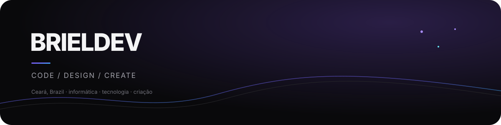

 

 

 

<h2 align="center">ABOUT</h2>

<h3 align="center">Versatile, curious, always building</h3>

  
  
  
  
  

 

  I'm <b>Gabriel</b>, an <b>IT Technician</b> student and developer with a versatile, multidisciplinary profile, focused on building well-structured <b>web systems</b>. I work across the whole stack — from intuitive <b>interface</b> design to <b>backend services</b> and <b>data layers</b> — seeking clean architecture, organized code and end-to-end solutions. I also have <b>game programming</b> notions with <b>Godot</b>, which broadens my logic and creativity. I care about <b>performance</b>, <b>reliability</b> and <b>maintainability</b> in what I build, and I believe you learn by doing: turning ideas into things that actually work.

 

 

<h2 align="center">STACK</h2>

<table align="center">
  <tr>
    <td align="center" valign="top" width="33%">
      <b>FRONT-END</b>  
      
      
    </td>
    <td align="center" valign="top" width="33%">
      <b>BACK-END</b>  
      
      
    </td>
    <td align="center" valign="top" width="33%">
      <b>DATABASE</b>  
      
      
    </td>
  </tr>
  <tr>
    <td align="center" valign="top">
      <b>TOOLS</b>  
      
      
      
      
    </td>
    <td align="center" valign="top">
      <b>DESIGN & VIDEO</b>  
      
      
      
      
      
    </td>
    <td align="center" valign="top">
      <b>GAME DEV</b>  
      
    </td>
  </tr>
</table>

 

 

<h2 align="center">EXPERIENCE &amp; ACHIEVEMENTS</h2>

  

<h3 align="center">IT Technician</h3>

  <b>EDUCATION</b> 
  EEEP Deputado José Maria Melo, Ceará 
  Ongoing technical degree.

  

<h3 align="center">Brazilian Technology Olympiad (OBT)</h3>

    <b>COMPETITION</b> &nbsp;·&nbsp; DevCore team 
  <b>Silver medal</b> — top performance in the 2026 edition with <b>Alerta Map</b>, a platform for reporting urban and natural disasters, connecting the community directly to the responsible agencies.  
  

  

<h3 align="center">Siará Tech</h3>

  <b>EVENT</b> 
  Ceará, Brazil 
  Presented <b>JuliaIA</b> — an AI psychologist assistant that combines technology and empathy to deliver accessible, humanized support.  
  

 

 

<h2 align="center">CONTACT</h2>

  Have an idea or a project in mind? Let's talk.

 

BRIELDEV &nbsp;·&nbsp; code &nbsp;·&nbsp; design &nbsp;·&nbsp; create

